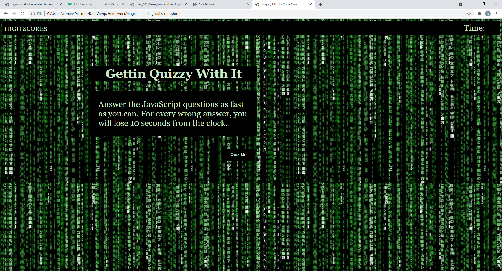
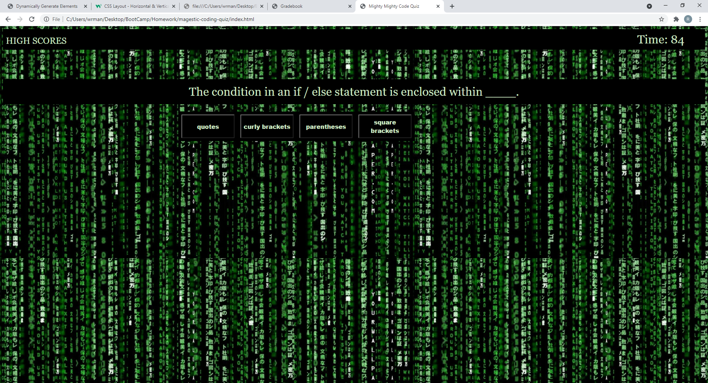
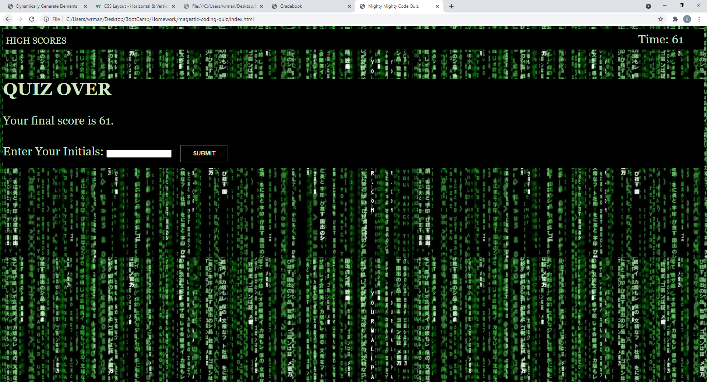
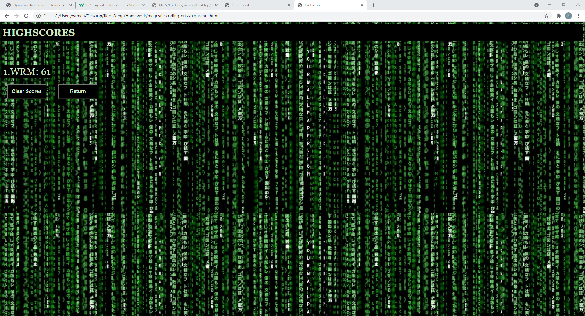

# magestic-coding-quiz
A multiple choice quiz about basic JavaScript
Questions rendered from array upon user clicking the "start" button
Answers are dynamically created as buttons for user to interact with and make their selection
An incorrect answer will still allow quiz to continue, but there will be a 10 second deduction in time left
At the end of the quiz, any time left is turned into the user's score
User is prompted to enter their initials and submit score
Score and initials are saved to local storage
Clicking the Submit button also brings user to the highscore page
Scores and intitals are retrieved from local storage to dynamically create table rows to display
User is offered buttons to clear Highscore list and return to the quiz's start page

Deployed App: https://wrmanns.github.io/magestic-coding-quiz/

